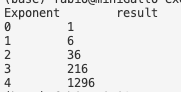

# Basics of Python

1. Print 10 times `moon`.
2. Ask the user for an integer. Print that amount of times the string `moon`.
3. Store an integer of your choice in a variable called `my_integer`. Print that integer multiplied by 6 and divided by 2, using the variable `my_integer`.

## Formatting of numbers

1. Store in a variable a decimal number with 10 decimal positions. Print that number rounded to the third position.
2. Print the first 5 powers of 6, getting an output similar to this:

    

    > Did you know that you can use `"\t"` to print a "tab" character?
3. Print the powers of 11 to the 6, to the 7, to the 8, to the 9, to the 10 with no more than 3 lines of code.
4. Refactor one of the previous exercises, using only **f-strings** in **print** statements - but only where it makes sense.

## Types of variables

1. write a program that asks for input, prints the Python type of the input entered, then starts again (again asking for input). Immediately quit the program when the input entered is `x`.

    > Did you know that you can use `while True` to execute an infinite loop, and then break it when needed with `break`?

## Iteration and conditions (difficult)

*Suggestion: try implementing these steps one at a time, like they were different exercises. Then, only after they work, collate them in one program.*

1. Ask the user for input **twice**.
2. If they enter two numbers, print their **product**.
3. If they enter two strings, print `Hello "string1" "string2"`.
4. If they enter other types of inputs, print an **error**.

Keep repeating the 4 steps above, asking for input and printing the output, until they enter `x` in any one of the two inputs. Entering `x` takes precedence over any other action and at that point, **quit** the program.

### Even more difficult: exceptions
In case of the step 3, instead of just printing an error, throw an exception, catch it and continue the program.

> ValueError is probably the correct exception in this case.
