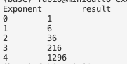

# Basics of Python

1. Print 10 times `moon`.
2. Ask the user for an integer. Print that amount of times the string `moon`.
3. Store an integer of your choice in a variable called `my_integer`. Print that integer multiplied by 6 and divided by 2, using the variable `my_integer`.
4. 

## Formatting of numbers

1. Store in a variable a decimal number with 10 decimal positions. Print that number rounded to the third position.
2. Print the first 5 powers of 6, getting an output similar to this:

    

    *did you know that you can use `"\t"` to print a "tab" character?*
3. Print the powers of 11 to the 6, to the 7, to the 8, to the 9, to the 10 with no more than 3 lines of code.
4. Refactor one of the previous exercises, using only **f-strings** in **print** statements - but only where it makes sense.
